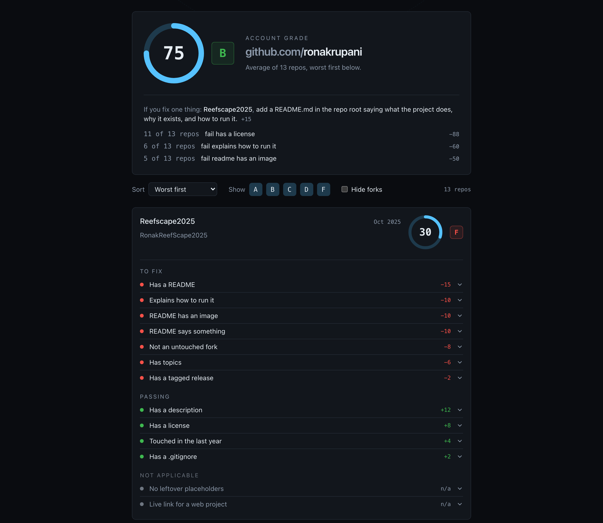

# GitGrade

See your GitHub the way a recruiter sees it.

Type a username. GitGrade fetches every public repo on the account, scores
each one out of 100 against thirteen repo hygiene rules, gives the account
an overall letter grade, and ranks the repos worst to best with the exact
fix for every failed check.

The output is a work queue, not a report.

Live at [gitgrade.vercel.app](https://gitgrade.vercel.app). Read only. No
login, no token required, no backend, and nothing is ever written to your
repos.

## Why I built it

I just cleaned up my own GitHub by hand across fourteen repos and kept
forgetting the same four things. Every repo I opened had one of them
missing, I would fix it, and then the next repo would be missing a
different one. I wanted the list in one place, in order, with the fix
written next to each item.

This is what it says about my account.

The first time I ran it, it gave me a B and told me that eleven of my
thirteen repos had no license. I had not noticed.

## The rules

One hundred points across thirteen checks. A check that does not apply to
a repo is left out of the denominator rather than counted as a failure, so
a Python library is not marked down for having no deployed URL.

| Check | Points | Passes when |
| --- | ---: | --- |
| Has a README | 15 | A README file exists |
| Has a description | 12 | The repo has a description |
| README says something | 10 | The README is at least 400 characters, not counting the repo name |
| README has an image | 10 | It contains a markdown image or an img tag |
| Explains how to run it | 10 | A code block contains an install or run command |
| Has a license | 8 | GitHub reports a license |
| No leftover placeholders | 8 | No TODO, TBD, coming soon, lorem ipsum or template text in the README |
| Not an untouched fork | 8 | Not a fork, or a fork the owner has pushed to since forking |
| Has topics | 6 | The repo has at least one topic |
| Live link for a web project | 5 | Only applies if the root has package.json or index.html; then needs a homepage URL |
| Touched in the last year | 4 | Pushed to within twelve months |
| Has a .gitignore | 2 | One is in the repo root |
| Has a tagged release | 2 | At least one release. Loaded after first paint, since it costs a request per repo |

Grades: A is 90 and up, B is 75 to 89, C is 60 to 74, D is 40 to 59, F is
below 40. The account grade is a plain average of the repo scores.

The README carries the most weight because it is the only thing most
visitors read. Description and topics score above their effort because
they are the cheapest possible wins and nearly everyone skips them.
Archived repos are left out entirely.

## Rate limits

GitHub allows 60 requests an hour without a token, and a scan costs about
two per repo. GitGrade caches every response in your browser for an hour,
so a second look at the same account costs nothing, and the header always
shows how many requests are left. If you need more, there is a field for
your own token. It is stored only in your browser and sent only to
api.github.com.

## Running it

    npm install
    npm run dev

## Scripts

    npm run dev      start the dev server
    npm test         run the test suite
    npm run lint     lint
    npm run build    typecheck and build

## How it is put together

React, Vite, TypeScript, Tailwind and Vitest. Plain fetch against the
GitHub REST API. No client library, no backend, no database.

Every check is one file under `src/checks/`, exporting an id, a title, a
weight, one sentence on why it matters, one sentence on how to fix it, and
a function from a repo to pass, fail or not applicable. A registry in
`src/checks/index.ts` collects them and the scoring engine in
`src/scoring.ts` does the arithmetic. Adding a check is one new file and
one line in the registry.

Every check has its own tests, and no test touches the network.
